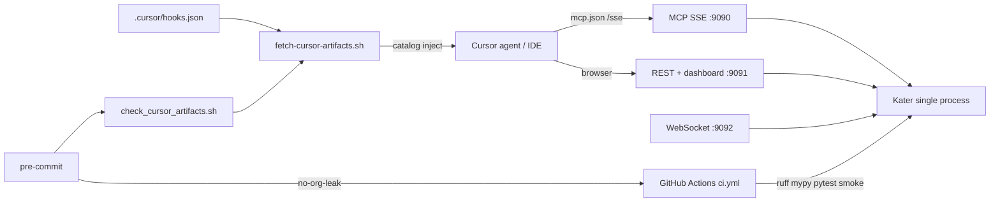

# Local and desktop verification

How to prove Kater works across environments and how Cursor, pre-commit, and CI
connect to the same gates.

## Environment matrix

| Surface | Cloud agent VM | Local Cursor IDE | Docker Compose |
| --- | --- | --- | --- |
| Install deps | `.cursor/environment.json` → `uv sync --dev` | `uv sync --dev` | `docker compose build` |
| Start gateway | Auto terminal: `uv run kater serve --profile core --no-proxy` | `uv run kater up` or `kater serve` | `docker compose up -d` |
| MCP for Cursor | Project `.cursor/mcp.json` → `:9090/sse` | Same (written by `kater up`) | Host-mapped `:9090` |
| Dashboard GUI | REST/curl + e2e (no browser required); optional xfce4/VNC desktop for manual pass | Browser on laptop | `http://localhost:9091` |
| Smoke CLI | `./scripts/smoke.sh` — **server stopped** | Same | Exec into container or run CLI on host against stopped bind-mount DB |
| E2E MCP + WS | `./scripts/e2e-mcp.sh` — **server running** | Same | Server container up |
| Pre-commit | `uvx pre-commit run --all-files` | `uvx pre-commit install` then commit | Run on host checkout (not inside container) |
| Org / Cursor guards | `no-org-leak` + `cursor-index` hooks | Same | Same |

## Koppelingen (Cursor ↔ gateway ↔ dashboard ↔ WS ↔ hooks ↔ CI)



**Flow in plain language:**

1. **Cursor** connects to **MCP SSE** on port 9090 (`type: sse`, url `http://127.0.0.1:9090/sse`).
2. The same **Kater process** serves **REST + dashboard** on 9091 and **WebSocket telemetry** on 9092.
3. **Hooks** (`.cursor/hooks.json`) run `fetch-cursor-artifacts.sh` on session start / post-tool-use to inject the skills/agents catalog.
4. **Pre-commit** runs `scripts/check_cursor_artifacts.sh` (`cursor-index` hook) plus `no-org-leak` before every commit.
5. **CI** mirrors lint, typecheck, tests, smoke, and org-leak — see `.github/workflows/ci.yml`.

## Command sequences

### One-time setup

```bash
cd kater-dev-tools
uv sync --dev
uvx pre-commit install
chmod +x .cursor/hooks/fetch-cursor-artifacts.sh scripts/check_cursor_artifacts.sh
```

### Cursor artifact check (manual)

```bash
bash scripts/check_cursor_artifacts.sh
# or via pre-commit:
uvx pre-commit run cursor-index --all-files
```

### Smoke — server **stopped**

Smoke drives the CLI against `.kater/kater.db`. A live `kater serve` causes concurrent-writer `disk I/O error`.

```bash
# Ensure nothing holds :9090-9092 (stop gateway terminal or docker compose)
uv run kater serve --help >/dev/null 2>&1 || true
pkill -f "kater serve" 2>/dev/null || true   # local only — skip in shared Cloud sessions

./scripts/smoke.sh
uv run pytest -q
```

### E2E — server **running**

```bash
export PATH="$HOME/.local/bin:$PATH"
uv run kater serve --profile core --no-proxy --host 127.0.0.1 &
sleep 2
curl -sf http://127.0.0.1:9091/health
./scripts/e2e-mcp.sh
```

Minimal core profile needs no adapter secrets. For proxied backends, add keys to `.kater/.env` and use `--profile ops` with proxy enabled.

### Pre-commit — run all hooks

```bash
uvx pre-commit run --all-files
```

Hooks include: whitespace/YAML/TOML, ruff lint+format, mypy, gitleaks, `no-org-leak`, and `cursor-index` (`check_cursor_artifacts.sh`).

### Desktop GUI check

1. Start the gateway (`uv run kater serve` or Cloud auto-terminal).
2. Open **http://127.0.0.1:9091** (dashboard).
3. Confirm `/health` returns 200 and the overview hydrates (no blocking error overlay).
4. Cloud VM: prefer REST/e2e evidence (`curl`, `./scripts/e2e-mcp.sh`). Optional xfce4/VNC
   desktop lets you open the same URL manually — not required for agent verify (see `local-verify`
   skill matrix: browser dashboard is desktop-first).

### Docker Compose (optional)

```bash
cp .env.example .env   # review KATER_PUBLIC / auth before exposing ports
docker compose up -d
curl -sf http://127.0.0.1:9091/health
./scripts/e2e-mcp.sh
```

## What NOT to commit

| Path | Why |
| --- | --- |
| `.kater/` | Local SQLite, secrets, runtime state |
| `.cursor/mcp.json` | Machine-local MCP wiring (often gitignored) |
| `.cursor/hooks/.state/` | Hook inject markers and catalog cache |
| `.env` with real keys | Adapter credentials |

Generic `.cursor/skills/` and `.cursor/agents/` **are** committed when they pass org-leak guards. Org-pinned overlays stay in the private deployment repo — see [private-cursor-overlay.md](./private-cursor-overlay.md).

## Related docs

- [Cursor setup](../cursor-setup.md) — MCP wiring, hooks, INDEX
- [CONTRIBUTING.md](../../CONTRIBUTING.md) — pre-commit install
- [private-cursor-overlay.md](./private-cursor-overlay.md) — org-pinned Cursor artifacts
